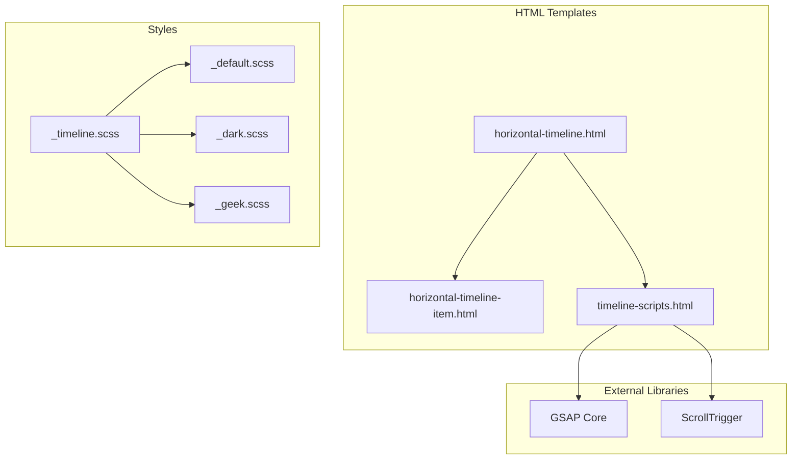

# Design Document: Timeline Redesign

## Overview

本设计文档描述了网站时间轴组件的重构方案。新的时间轴将使用GSAP动画库实现炫酷的滚动触发动画，并通过CSS变量系统支持三种主题（亮色、暗色、极客）的自动切换。

### 设计目标

1. **视觉升级**: 使用GSAP ScrollTrigger实现流畅的滚动触发动画
2. **主题适配**: 完全基于CSS变量，支持三种主题无缝切换
3. **性能优化**: 使用纯CSS实现连接线，减少JavaScript计算
4. **代码质量**: 清晰的文件分离，便于维护和扩展

## Architecture

### 文件结构

```
_includes/
├── horizontal-timeline.html      # 主时间轴模板（重构）
├── horizontal-timeline-item.html # 时间轴项目模板（重构）
└── timeline-scripts.html         # GSAP脚本加载和初始化（新增）

_sass/
├── _timeline.scss                # 时间轴专用样式（新增）
├── theme/
│   ├── _default.scss            # 添加时间轴CSS变量
│   ├── _dark.scss               # 添加时间轴CSS变量
│   └── _geek.scss               # 添加时间轴CSS变量
```

### 技术栈

- **动画库**: GSAP 3.x + ScrollTrigger (CDN加载)
- **样式**: SCSS + CSS Variables
- **模板**: Jekyll Liquid

### 架构图



## Components and Interfaces

### 1. Timeline Container Component

**文件**: `_includes/horizontal-timeline.html`

**职责**:
- 渲染时间轴容器
- 包含连接线元素
- 加载GSAP脚本
- 初始化动画

**接口**:
```liquid

```

**参数**:
- `items`: 时间轴项目数组，每个项目包含 `title`, `date`, `excerpt`, `url` 等字段

### 2. Timeline Item Component

**文件**: `_includes/horizontal-timeline-item.html`

**职责**:
- 渲染单个时间轴项目
- 包含节点、内容卡片
- 支持动画类名

**接口**:
```liquid

```

**参数**:
- `item`: 单个时间轴项目对象
- `index`: 项目索引（用于动画延迟）

### 3. Timeline Scripts Component

**文件**: `_includes/timeline-scripts.html`

**职责**:
- 加载GSAP和ScrollTrigger库
- 初始化滚动触发动画
- 处理降级方案

**接口**:
```liquid

```

## Data Models

### Timeline Item Data Structure

```typescript
interface TimelineItem {
  title: string;           // 项目标题
  date: Date;              // 日期
  excerpt?: string;        // 摘要描述
  url?: string;            // 链接地址
  header?: {
    teaser?: string;       // 缩略图
  };
}
```

### CSS Variables Schema

```scss
// 时间轴专用CSS变量
:root {
  // 颜色
  --timeline-accent-color: <color>;      // 主强调色
  --timeline-accent-secondary: <color>;  // 次强调色
  --timeline-card-bg: <color>;           // 卡片背景
  --timeline-card-shadow: <shadow>;      // 卡片阴影
  --timeline-text-color: <color>;        // 文字颜色
  --timeline-date-bg: <color>;           // 日期标签背景
  --timeline-date-color: <color>;        // 日期标签文字
  --timeline-line-gradient: <gradient>;  // 连接线渐变
  --timeline-node-border: <color>;       // 节点边框色
  --timeline-node-bg: <color>;           // 节点背景色
  --timeline-glow: <shadow>;             // 发光效果（极客主题）
}
```

### Animation Configuration

```javascript
const timelineAnimationConfig = {
  // 项目入场动画
  itemEntrance: {
    y: 50,           // 起始Y偏移
    opacity: 0,      // 起始透明度
    duration: 0.8,   // 动画时长
    ease: "power2.out",
    stagger: 0.15    // 错开延迟
  },
  
  // 节点动画
  nodeAnimation: {
    scale: 0,
    duration: 0.5,
    ease: "back.out(1.7)"
  },
  
  // 连接线动画
  lineAnimation: {
    scaleX: 0,
    transformOrigin: "left center",
    duration: 1.2,
    ease: "power2.inOut"
  },
  
  // ScrollTrigger配置
  scrollTrigger: {
    trigger: ".horizontal-timeline",
    start: "top 80%",
    toggleActions: "play none none reverse"
  }
};
```


## Correctness Properties

*A property is a characteristic or behavior that should hold true across all valid executions of a system—essentially, a formal statement about what the system should do. Properties serve as the bridge between human-readable specifications and machine-verifiable correctness guarantees.*


Based on the prework analysis, the following properties have been identified:

### Property 1: No Hardcoded Colors

*For any* color definition in the timeline SCSS file, it SHALL use CSS variables (var(--*)) or SCSS variables that reference CSS variables, and SHALL NOT contain hardcoded color values (hex codes like #007acc, rgb(), rgba(), hsl(), or named colors).

**Validates: Requirements 1.1, 1.5**

### Property 2: Theme CSS Variables Completeness

*For any* theme configuration (default, dark, geek), the theme SCSS file SHALL define all required timeline CSS variables (--timeline-accent-color, --timeline-card-bg, --timeline-line-gradient, etc.), ensuring complete theme coverage.

**Validates: Requirements 1.6, 4.3**

### Property 3: CSS-Only Connector Line

*For any* timeline rendering, the connector line width and position SHALL be determined purely by CSS (using percentage widths, flexbox, or grid), without JavaScript calculations for dimensions.

**Validates: Requirements 4.1**

## Error Handling

### GSAP Loading Failure

**Scenario**: GSAP CDN fails to load or is blocked

**Handling**:
1. JavaScript checks for `window.gsap` existence before initialization
2. If GSAP is unavailable, add `.no-gsap` class to timeline container
3. CSS provides fallback animations using `@keyframes`

```javascript
// Fallback check
if (typeof gsap === 'undefined' || typeof ScrollTrigger === 'undefined') {
  document.querySelector('.horizontal-timeline')?.classList.add('no-gsap');
  console.warn('GSAP not loaded, using CSS fallback animations');
  return;
}
```

### Empty Timeline Data

**Scenario**: No items passed to timeline component

**Handling**:
1. Check if `items` array is empty in Liquid template
2. Display placeholder message if no items

```liquid

  <p class="timeline-empty">暂无时间轴数据</p>

  <!-- render timeline -->

```

### Reduced Motion Preference

**Scenario**: User has `prefers-reduced-motion: reduce` enabled

**Handling**:
1. CSS media query disables/reduces animations
2. JavaScript checks preference before initializing GSAP

```scss
@media (prefers-reduced-motion: reduce) {
  .horizontal-timeline-item {
    animation: none !important;
    opacity: 1 !important;
    transform: none !important;
  }
}
```

## Testing Strategy

### Unit Tests

Unit tests will focus on specific examples and edge cases:

1. **Theme Variable Tests**: Verify each theme file defines required CSS variables
2. **Template Rendering Tests**: Verify templates render correct HTML structure
3. **Fallback Tests**: Verify CSS fallback animations are defined

### Property-Based Tests

Property-based tests will verify universal properties:

1. **No Hardcoded Colors**: Scan SCSS for color patterns, verify all use CSS variables
2. **Theme Completeness**: For each theme, verify all required variables are defined
3. **CSS-Only Line**: Verify no JavaScript calculates line dimensions

### Integration Tests

Manual integration tests:

1. **Theme Switching**: Manually verify colors change when switching themes
2. **Scroll Animation**: Manually verify animations trigger on scroll
3. **Mobile Responsiveness**: Test on various screen sizes

### Test Configuration

- Property-based tests: Minimum 100 iterations
- Test framework: Jest (for JavaScript) or manual verification (for SCSS)
- Tag format: **Feature: timeline-redesign, Property {number}: {property_text}**
