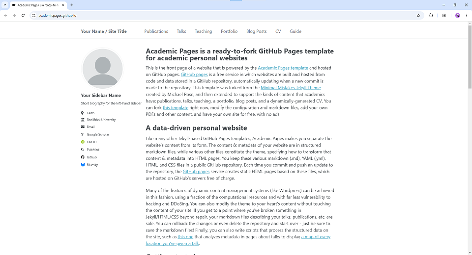

# 个人作品集网站

基于 Academic Pages 模板构建的个人作品集网站，用于展示个人项目、课程作业和实验室工作。



## 项目简介

这是一个使用 Jekyll 构建的静态网站，托管在 GitHub Pages 上。网站采用响应式设计，支持多种主题切换，适合展示学术作品、项目经历和个人简历。

### 主要特性

- 📱 响应式设计，支持移动端和桌面端
- 🎨 多主题支持（默认、暗色、极客风格）
- 📝 Markdown 内容管理
- 🔍 SEO 优化
- 📊 支持 Google Analytics
- 💬 评论系统集成（可选）
- 📄 PDF 导出功能
- 🌐 多语言支持（中文/英文）

## 技术栈

- **静态站点生成器**: Jekyll 3.x
- **前端框架**: HTML5, CSS3 (Sass), JavaScript
- **UI 库**: jQuery, FitVids
- **主题**: 基于 Minimal Mistakes 定制
- **托管平台**: GitHub Pages
- **包管理**: 
  - Ruby: Bundler
  - Node.js: npm

## 项目结构

```
.
├── _config.yml           # Jekyll 配置文件
├── _data/               # 数据文件（导航、简历等）
├── _includes/           # 可复用的 HTML 片段
├── _layouts/            # 页面布局模板
├── _pages/              # 静态页面
├── _projects/           # 个人项目集合
├── _coursework/         # 课程作业集合
├── _labwork/            # 实验室工作集合
├── _sass/               # Sass 样式文件
├── assets/              # 静态资源（CSS、JS、字体）
├── images/              # 图片资源
├── files/               # 文档文件（PDF 等）
└── _site/               # 生成的静态网站（自动生成）
```

## 代码框架详解

### 核心架构

本项目基于 Jekyll 静态站点生成器，采用 **MVC 模式**的变体架构：

- **Model（数据层）**: `_data/` 目录存储结构化数据（YAML/JSON）
- **View（视图层）**: `_layouts/` 和 `_includes/` 提供模板系统
- **Content（内容层）**: `_pages/`、`_projects/`、`_coursework/` 等集合存储 Markdown 内容

### 目录结构详解

#### 1. 配置文件

**`_config.yml`** - 站点全局配置
- 站点基本信息（标题、描述、URL）
- 作者信息和社交媒体链接
- 主题设置（支持 default/dark/geek 三种主题）
- 集合定义和默认布局
- 插件配置和构建选项

```yaml
# 示例配置
locale: "zh-CN"
site_theme: "geek"
title: "作品合集"
author:
  name: "Your Name"
  bio: "个人简介"
```

#### 2. 数据层 (`_data/`)

**`navigation.yml`** - 导航菜单配置
```yaml
main:
  - title: "个人作品"
    url: /projects/
  - title: "课程作业"
    url: /coursework/
```

**`cv.json`** - 简历数据（JSON 格式）
- 支持结构化简历数据
- 可通过模板动态渲染

**`ui-text.yml`** - 多语言界面文本
- 支持国际化（i18n）
- 可扩展多语言支持

#### 3. 视图层

**`_layouts/`** - 页面布局模板

主要布局文件：
- `default.html` - 基础布局，包含 head、header、footer
- `single.html` - 单页内容布局（用于文章、项目详情）
- `archive.html` - 归档列表布局
- `talk.html` - 演讲/讲座专用布局

布局继承关系：
```
compress (压缩) 
  └── default (基础布局)
      ├── single (单页)
      ├── archive (归档)
      └── talk (演讲)
```

**`_includes/`** - 可复用组件

核心组件：
- `head.html` - HTML head 部分（meta、CSS 引入）
- `masthead.html` - 顶部导航栏
- `author-profile.html` - 作者信息侧边栏
- `footer.html` - 页脚
- `scripts.html` - JavaScript 引入
- `analytics.html` - 网站分析代码

使用方式：
```liquid

```

#### 4. 内容集合

Jekyll Collections 用于组织不同类型的内容：

**`_projects/`** - 个人项目
```markdown
---
title: "项目名称"
excerpt: "项目简介"
date: 2024-01-01
collection: projects
permalink: /projects/project-name/
---
项目详细内容...
```

**`_coursework/`** - 课程作业
- 支持丰富的 Markdown 格式
- 可嵌入图片、代码、公式
- 自动生成目录和归档

**`_labwork/`** - 实验室工作
- 与 coursework 结构类似
- 独立的 URL 路径和归档页面

**`_pages/`** - 静态页面
- `about.md` - 关于页面
- `cv.md` - 简历页面
- `projects.html` - 项目列表页
- `coursework.html` - 课程作业列表页

#### 5. 样式系统 (`_sass/`)

采用模块化 Sass 架构：

```
_sass/
├── _base.scss              # 基础样式
├── _syntax.scss            # 代码高亮
├── _themes.scss            # 主题切换逻辑
├── theme/                  # 主题样式
│   ├── _default.scss       # 默认主题
│   ├── _dark.scss          # 暗色主题
│   └── _geek.scss          # 极客主题
├── layout/                 # 布局样式
│   ├── _archive.scss       # 归档页面
│   ├── _masthead.scss      # 顶部导航
│   ├── _sidebar.scss       # 侧边栏
│   └── _page.scss          # 页面内容
├── include/                # 工具函数
│   ├── _mixins.scss        # Sass mixins
│   └── _utilities.scss     # 工具类
└── vendor/                 # 第三方库
    └── susy/               # 网格系统
```

主题切换机制：
```scss
// _themes.scss
[data-theme="dark"] {
  @import "theme/dark";
}
[data-theme="geek"] {
  @import "theme/geek";
}
```

#### 6. 静态资源 (`assets/`)

**CSS**
- `main.scss` - 主样式入口（编译所有 Sass）
- `academicons.css` - 学术图标库
- `cv-style.css` - 简历专用样式

**JavaScript**
- `theme.js` - 主题切换功能
- `collapse.js` - 折叠面板功能
- `pdf-export.js` - PDF 导出功能
- `main.min.js` - 压缩后的主 JS 文件

**字体**
- `academicons.*` - 学术图标字体
- `webfonts/` - Font Awesome 图标

#### 7. 图片和文件

**`images/`** - 图片资源
- 头像、背景图
- 项目截图
- 主题预览图
- 按项目分类的子目录（如 `autocontrol/`）

**`files/`** - 文档文件
- PDF 文档
- 简历文件
- 论文、报告等

### 工作流程

#### 1. 内容创建流程

```
编写 Markdown → Front Matter 配置 → Jekyll 处理 → 应用布局 → 生成 HTML
```

示例：
```markdown
---
title: "我的项目"           # 标题
collection: projects        # 所属集合
layout: single             # 使用的布局
date: 2024-01-01           # 日期
permalink: /projects/my-project/  # 自定义 URL
---

# 项目内容
这里是项目的详细描述...
```

#### 2. 构建流程

```
Markdown 文件 → Jekyll 解析 → Liquid 模板渲染 → Sass 编译 → 静态 HTML/CSS
```

#### 3. 主题切换流程

```
用户点击主题按钮 → theme.js 修改 data-theme 属性 → CSS 应用对应主题样式
```

### 核心技术

#### Liquid 模板语言

Jekyll 使用 Liquid 作为模板引擎：

**变量输出**
```liquid
{{ site.title }}
{{ page.title }}
{{ author.name }}
```

**条件判断**
```liquid

  <a href="mailto:{{ author.email }}">{{ author.email }}</a>

```

**循环**
```liquid

  <h2>{{ project.title }}</h2>

```

**包含文件**
```liquid

```

#### Front Matter

每个内容文件顶部的 YAML 配置：

```yaml
---
title: "文章标题"
layout: single
author_profile: true
read_time: true
comments: true
share: true
related: true
---
```

#### Collections（集合）

在 `_config.yml` 中定义：

```yaml
collections:
  projects:
    output: true
    permalink: /:collection/:path/
  coursework:
    output: true
    permalink: /:collection/:path/
```

### 扩展功能

#### 1. 评论系统

支持多种评论系统（在 `_config.yml` 配置）：
- Disqus
- Discourse
- Facebook Comments
- Staticman

#### 2. 分析统计

支持 Google Analytics：
```yaml
analytics:
  provider: "google-analytics-4"
  google:
    tracking_id: "YOUR-ID"
```

#### 3. SEO 优化

- 自动生成 sitemap.xml
- 支持 Open Graph 标签
- 结构化数据（Schema.org）
- RSS Feed 生成

#### 4. 响应式设计

使用 Susy 网格系统和媒体查询：
```scss
@include breakpoint($medium) {
  // 中等屏幕样式
}
@include breakpoint($large) {
  // 大屏幕样式
}
```

### 开发工具链

#### 构建工具

**Ruby/Bundler**
- 管理 Jekyll 和插件依赖
- `bundle exec jekyll serve` 启动开发服务器

**npm**
- 管理前端依赖（jQuery、FitVids）
- UglifyJS 压缩 JavaScript
- `npm run build:js` 构建压缩后的 JS

#### 开发命令

```bash
# 启动开发服务器（自动重载）
bundle exec jekyll serve -l -H localhost

# 构建生产版本
bundle exec jekyll build

# 清理生成文件
bundle exec jekyll clean

# 压缩 JavaScript
npm run build:js

# 监听 JS 文件变化
npm run watch:js
```

### 性能优化

1. **HTML 压缩** - 使用 compress layout
2. **CSS 压缩** - Sass 输出为 compressed 模式
3. **JS 压缩** - UglifyJS 压缩合并
4. **图片优化** - 建议使用 WebP 格式
5. **懒加载** - 图片使用 loading="lazy"
6. **CDN** - 字体和图标使用 CDN

### 自定义扩展

#### 添加新的集合

1. 在 `_config.yml` 中定义：
```yaml
collections:
  publications:
    output: true
    permalink: /:collection/:path/
```

2. 创建目录 `_publications/`

3. 创建列表页面 `_pages/publications.html`

4. 添加到导航 `_data/navigation.yml`

#### 自定义主题

1. 在 `_sass/theme/` 创建新主题文件
2. 在 `_sass/_themes.scss` 中引入
3. 在 `_config.yml` 中设置 `site_theme`

#### 添加新功能

1. 在 `_includes/` 创建组件
2. 在需要的布局中引入
3. 添加对应的样式和脚本

### 最佳实践

1. **内容组织** - 使用集合分类不同类型的内容
2. **命名规范** - 文件名使用小写和连字符
3. **图片管理** - 按项目分类存储图片
4. **版本控制** - 使用 Git 管理代码和内容
5. **性能监控** - 定期检查页面加载速度
6. **SEO 优化** - 填写完整的 meta 信息
7. **响应式测试** - 在多种设备上测试布局

## 快速开始

### 环境要求

- Ruby 2.7+
- Node.js 12+
- Bundler
- Git

### 安装步骤

#### Windows 系统

1. 克隆仓库
```bash
git clone https://github.com/YIZHIXIAOCANGSHU/YIZHIXIAOCANGSHU.github.io.git
cd YIZHIXIAOCANGSHU.github.io
```

2. 安装 Ruby 依赖
```bash
bundle install
```

如果遇到权限问题，可以本地安装：
```bash
bundle config set --local path 'vendor/bundle'
bundle install
```

3. 安装 Node.js 依赖
```bash
npm install
```

4. 启动开发服务器

使用提供的批处理脚本：
```bash
start.bat
```

或手动启动：
```bash
bundle exec jekyll serve --drafts --host 127.0.0.1 --port 4000 --force_polling
```

5. 访问网站

打开浏览器访问 `http://localhost:4000`

#### Linux/macOS 系统

1. 安装依赖
```bash
# Ubuntu/Debian
sudo apt install ruby-dev ruby-bundler nodejs build-essential gcc make

# macOS
brew install ruby node
gem install bundler
```

2. 克隆并安装
```bash
git clone https://github.com/YIZHIXIAOCANGSHU/YIZHIXIAOCANGSHU.github.io.git
cd YIZHIXIAOCANGSHU.github.io
bundle install
npm install
```

3. 启动服务器
```bash
bundle exec jekyll serve -l -H localhost
```

### 使用 Docker

如果不想安装依赖，可以使用 Docker：

```bash
chmod -R 777 .
docker compose up
```

访问 `http://localhost:4000`

## 配置说明

### 基本配置

编辑 `_config.yml` 文件修改网站基本信息：

```yaml
# 网站信息
title: "作品合集"
locale: "zh-CN"
site_theme: "geek"  # 可选: default, dark, geek

# 作者信息
author:
  name: "Your Name"
  bio: "个人简介"
  location: "城市"
  email: "your.email@example.com"
  github: "your-github-username"
```

### 添加内容

#### 添加项目

在 `_projects/` 目录下创建 Markdown 文件：

```markdown
---
title: "项目名称"
excerpt: "项目简介"
date: 2024-01-01
---

项目详细内容...
```

#### 添加课程作业

在 `_coursework/` 目录下创建 Markdown 文件，格式同上。

#### 添加文件

将 PDF、图片等文件放入 `files/` 目录，可通过以下方式访问：
```
https://your-username.github.io/files/filename.pdf
```

### 主题切换

网站支持三种主题，在 `_config.yml` 中修改：

```yaml
site_theme: "default"  # 或 "dark" 或 "geek"
```

## 构建和部署

### 本地构建

```bash
bundle exec jekyll build
```

生成的网站在 `_site/` 目录。

### 部署到 GitHub Pages

1. 推送代码到 GitHub
```bash
git add .
git commit -m "Update content"
git push origin main
```

2. GitHub Actions 会自动构建和部署

3. 访问 `https://your-username.github.io`

## 开发指南

### 修改样式

样式文件位于 `_sass/` 目录，使用 Sass 编写。主要文件：

- `_sass/_base.scss` - 基础样式
- `_sass/theme/` - 主题样式
- `_sass/layout/` - 布局样式

### 修改布局

布局模板位于 `_layouts/` 目录：

- `default.html` - 默认布局
- `single.html` - 单页布局
- `archive.html` - 归档页面布局

### 添加功能

可复用的组件位于 `_includes/` 目录，可以在页面中通过以下方式引入：

```liquid

```

## 常见问题

### 端口被占用

修改 `start.bat` 或启动命令中的端口号：
```bash
bundle exec jekyll serve --port 4001
```

### 样式未更新

清除缓存并重新构建：
```bash
bundle exec jekyll clean
bundle exec jekyll build
```

### 权限错误

使用本地 Gem 安装：
```bash
bundle config set --local path 'vendor/bundle'
bundle install
```

## 贡献

欢迎提交 Issue 和 Pull Request！

## 许可证

本项目基于 MIT 许可证开源。

原始模板来自 [Academic Pages](https://github.com/academicpages/academicpages.github.io)，由 Michael Rose 创建。

## 联系方式

- Email: 2752722697@qq.com
- GitHub: [@YIZHIXIAOCANGSHU](https://github.com/YIZHIXIAOCANGSHU)

---

⭐ 如果这个项目对你有帮助，欢迎 Star！
